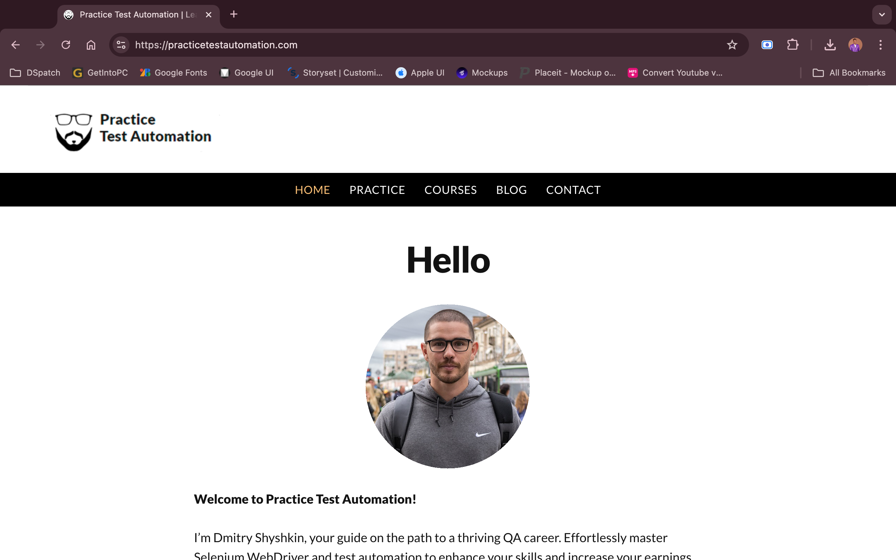

# Selenium Test Automation with Pytest (Page Object Model)

This project demonstrates a set of UI automation tests using `Selenium` and `pytest` to test the login functionality of the website [Practice Test Automation](https://practicetestautomation.com/). The tests are designed following the **Page Object Model (POM)** approach, which improves test maintainability and readability by separating the test logic from the page structure.




[](https://youtu.be/7AdCcdn0epM?si=QbgjP_CbrCrBWdkN)

## Prerequisites

Before running the tests, ensure you have the following installed on your system:

1. **Python 3.7+**: Ensure Python is installed. You can download it from [python.org](https://www.python.org/downloads/).
2. **Google Chrome**: Download and install Chrome from [here](https://www.google.com/chrome/).
3. **ChromeDriver**: Download the appropriate ChromeDriver from [ChromeDriver Downloads](https://sites.google.com/chromium.org/driver/). Ensure it's added to your system's PATH.

## Installation

Follow these steps to set up the project:

1. Clone the repository or download the project files.

2. Install the required Python dependencies. You can do this by running the following command:

    ```bash
    pip install -r requirements.txt
    ```

3. Verify that ChromeDriver is installed and available in your system's PATH.

## Page Object Model Structure

This project follows the **Page Object Model (POM)** design pattern, which helps to keep the test code clean and maintainable by separating the logic for interacting with page elements into individual classes.

- **BasePage**: Contains common methods like finding elements and retrieving the current URL.
- **HomePage**: Inherits from `BasePage` and contains methods specific to the home page (e.g., navigating to the login page).
- **LoginPage**: Inherits from `BasePage` and contains methods for interacting with the login page (e.g., entering username, password, and submitting the form).

## Folder Structure

```
simple-login-automation_POM-approach/
│
├── pages/                  # Page Object Model classes
│   ├── base_page.py        # BasePage class with common web element interactions
│   ├── home_page.py        # HomePage class with specific methods for home page interactions
│   └── login_page.py       # LoginPage class with specific methods for login page interactions
│
├── tests/                  # Contains the test cases
│   └── test_cases.py       # Pytest test cases for login functionality
│
├── ref/                    # Folder for storing images
│   └── Img_1.png           # Screenshot of the website
    └── Img_2.png
    └── Img_3.png
    └── Img_4.png
    └── thumbnail.png
│
├── requirements.txt        # Lists project dependencies
└── README.md               # This documentation
```

## Running the Tests

### 1. Positive Login Test

This test case verifies the correct login functionality using valid credentials.

```bash
pytest -k test_login_page
```

### 2. Negative Login Test: Invalid Username

This test case checks the error message displayed when an invalid username is entered.

```bash
pytest -k test_negative_username
```

### 3. Negative Login Test: Invalid Password

This test case checks the error message displayed when an invalid password is entered.

```bash
pytest -k test_negative_password
```

### 4. Navigation Test

This test case verifies that the navigation to the login page works correctly.

```bash
pytest -k test_navigate_to_login_page
```

## Test Cases Description

### 1. `test_navigate_to_login_page`

- **Steps**:
  - Navigate to `https://practicetestautomation.com/`.
  - Click the "Practice" button.
  - Click the "Test Login Page" link.
  - Verify the URL is `https://practicetestautomation.com/practice-test-login/`.

### 2. `test_login_page`

- **Steps**:
  - Navigate to the login page.
  - Enter the valid username (`student`) and password (`Password123`).
  - Submit the form.
  - Verify the user is redirected to the success page.
  - Confirm the presence of the "Congratulations" or success message.
  - Ensure the "Log out" button is displayed.

### 3. `test_negative_username`

- **Steps**:
  - Navigate to the login page.
  - Enter an invalid username (`incorrectUser`) and a valid password (`Password123`).
  - Submit the form.
  - Verify the error message "Your username is invalid!" is displayed.

### 4. `test_negative_password`

- **Steps**:
  - Navigate to the login page.
  - Enter a valid username (`student`) and an invalid password (`incorrectPassword`).
  - Submit the form.
  - Verify the error message "Your password is invalid!" is displayed.

## Running All Tests

To run all the test cases together, you can simply execute:

```bash
pytest
```

## Notes

- Each test case is structured using the **Page Object Model (POM)**, making the test code cleaner and easier to maintain.
- `pytest` fixtures handle setting up and tearing down the WebDriver (`setup_driver()`).
- Explicit waits are recommended to ensure elements are interactable.
- Ensure that your ChromeDriver matches the version of Google Chrome installed on your system.

## Future Improvements

- Add more test cases to cover edge scenarios (e.g., empty username, empty password, etc.).
- Implement headless browser execution for running tests in a CI/CD pipeline.
- Extend POM to cover additional features of the website.

Of course, this code can be improved by adding better exception handling, enhancing logging, or introducing utilities for wait times, but this is just a sample of the POM approach in action. The goal is to show how you can organize your test scripts more efficiently and scale as your project grows.
